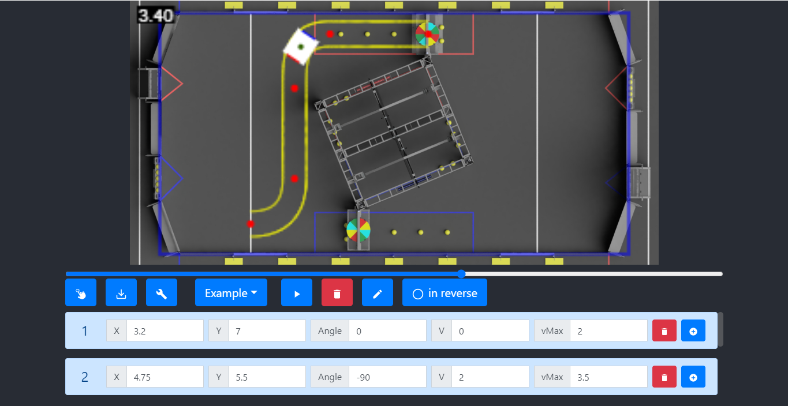

# PathGenerator

**PathGenerator** is a motion profile generator, which you can easily use to draw a path for your robot to follow.  
When you finish setting up the path for your robot to follow, just press on the export button on the left for exporting 
the path to a CSV file to your *paths csv directory* and use it on your robot to follow the path. 

## Setup Instructions:
### Release Installation:
* Download the latest version [here.](https://github.com/matanabc/path-generator/releases)

### Source Installation:
1. Install [Node.js](https://nodejs.org)
1. Clone this repository
1. Install all project dependencies: `npm i -g`

* Basic npm Commands:
    * Run Development Mode: `npm start`
    * Build: `npm run build`
        * Build file will located in `/dist` folder
