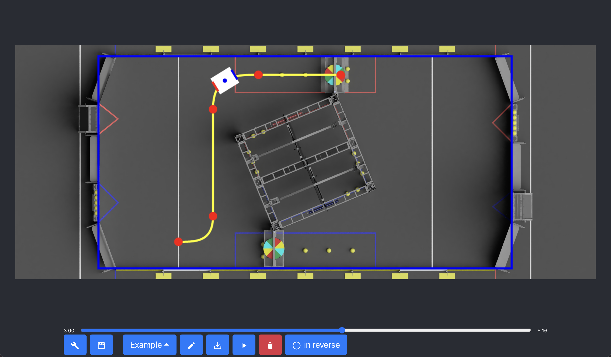

# PathGenerator

**PathGenerator** is a motion profile path generator, which you can easily use to draw a path for your robot to follow.  
When you finish setting up the path for your robot to follow, just press on the export button and use the CSV files on your robot to follow the path.

**PathGenerator** is based on [PathGenerator](https://www.npmjs.com/package/path-generator) package.

## Setup Instructions:

### Release:

-   Web latest version [here](https://matanabc.github.io/path-generator-app/)
-   Download desktop latest version [here](https://github.com/matanabc/path-generator-app/releases)

### Source:

1. Install [Node.js](https://nodejs.org)
1. Clone this repository
1. Install all project dependencies: `npm i`

-   npm commands:
    -   Development:
        -   `npm run start-web` to run in web mode
        -   `npm run start-app` to run in desktop mode
    -   Build:
        -   `npm run build-web` to build for web, Build files will located in `/build` folder
        -   `npm run build-app` to build for desktop, Build files will located in `/dist` folder

## Usage Instructions:

### Setup project:

Before you start planning your path you will need to setup your project in settings. 
This is all you need to know for your project setup (settings):

1. **Folders Config** - All the folders for your project
    - **_Project folder_** - Where the project setting, paths and groups will be saved
    - **_Path CSV folder_** - Where to export path CSV for your robot to use
2. **Path Config** - All the information needed for calculating robot path
    - **_Tank or Holonomic_** - Robot drive type
    - **_Width and Length_** - Robot size in meters
    - **_Max V and Acc_** - Robot max Velocity and acceleration in meters
    - **_Loop time_** - Robot loop time in sec
3. **Filed Config**
    - **_Width and Height_** - Field size in meters
    - **_Image_** - Field image to use, it can be image name in project folder or URL
    - **_Top Left X and Y, Width and Height_** - Filed position in the field image
4. **Robot Draw Config** - All the information needed for drawing your robot
    - **_Width and Length_** - Robot full size with bumper in meters
    - **_Center_** - Robot center in meters

### Path Planning Usage:

After you finish setting up your project, all you need to do is create a path and start planning it. 
This is all you need to know for planning your path:

1. **Create A New Path**
    - Click on `select path` button and then `new path`
    - Choose the name for your path
2. **Add Waypoint**
    - Hold ctrl button and drag a waypoint
3. **Config Waypoint**
    - Drag a waypoint to move it on the filed
    - Double click a waypoint to open waypoint info
    - Click on a waypoint and then scroll for changing waypoint angle
    - Click on a waypoint and then hold ctrl and scroll for changing waypoint robot angle (only for Holonomic)
4. **Play Path Preview**
    - Click on the `play` button to see how the robot will follow the path
    - Move the slider to the part in the path you want to see how your robot will be positioned
    - Click on the filed and then scroll to see your robot following the path
5. **Export The Path**
    - Click on the `download` button to export the path as CSV file

### Group Planning Usage

After you finish creating the paths, you can create groups with those paths to see a preview off all the paths together. 
This is all you need to know for planning your group:

1. **Create A Group**
    - Click on `select group` button and then `new group`
    - Choose the name for your group
2. **Set Group Paths**
    - Click on `add path to group` button
    - Drag path name from _paths to use_ to _paths in group_
        - To change paths order in group drag the path name from _paths in group_ to the position you want
3. **Play The Group**
    - Click on the `play` button to see how the robot will follow the path
    - Move the slider to the part in the path you want to see how your robot will be positioned
    - Click on the filed and then scroll to see your robot following the path
4. **Export Group Paths**
    - Click on the `download` button to export the path as CSV file

### Shortcuts:

|   Action    |         Description          |
| :---------: | :--------------------------: |
| ⌘ / alt + s | export path for robot to use |
| ⌘ / alt + f |    change direction path     |
| ⌘ / alt + n |     create path / group      |
| ⌘ / alt + r |     rename path / group      |
| ⌘ / alt + d |     delete path / group      |
| ⌘ / alt + p |        open settings         |
| ⌘ / alt + m |         change mode          |
